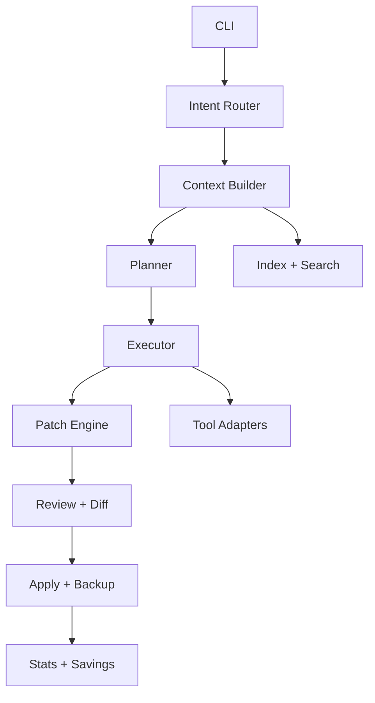

# obot Scaling Plan

This plan defines the technical and product scaffolding to move obot from a fast local fixer to a Claude Code class CLI, while staying local-first and cost-transparent.

## Goals

- Ship a reliable, fast, local-first code fixer with multi-file competence.
- Provide reviewable, deterministic edits with rich diff output.
- Offer competitive productivity features without cloud lock-in.
- Keep a power-user default while supporting optional guardrails.

## North Star Flows

- Quick fix: one file or range -> patch -> apply -> summary.
- Scoped refactor: multi-file -> plan -> staged patches -> review -> apply.
- Interactive edit: chat loop with apply/discard and history.
- Project scan: repo context -> issue list -> targeted fixes.

## Architecture Overview

## Core Modules

- `internal/cli`: command parsing, UX, interactive flow.
- `internal/context`: file loading, range handling, project graph.
- `internal/index`: fast file index, language map, embeddings (optional).
- `internal/planner`: task decomposition, change plan, risk labeling.
- `internal/executor`: model calls, streaming, retry, timeouts.
- `internal/patch`: unified diff, AST-aware edits, conflict handling.
- `internal/review`: lint, tests, static checks, diff summaries.
- `internal/tools`: git, search, test runner, formatter, linter hooks.
- `internal/telemetry`: local stats, cost savings, performance metrics.

## CLI Surface (Target)

- `obot file.go [-start +end] [instruction]`
- `obot fix [path] --scope repo|dir|file --plan --apply`
- `obot review [path] --diff --tests`
- `obot search "query" --files --symbols`
- `obot stats`, `obot config`, `obot models`
- `obot init` to scaffold config and cache paths

## Model Strategy

- Default to local Ollama models with RAM-aware tiering.
- Multi-model routing for plan vs. edit vs. review.
- Optional `--model` override and `--offline` strict mode.
- Store model selection metadata with stats for evaluation.

## Diff and Patch Strategy

- Always produce a unified diff first.
- Apply patches atomically with backup and rollback.
- Provide `--dry-run` and `--diff-only` modes.
- Add patch validation and file checksum verification.

## Context Strategy

- File range context for fast edits.
- Repo context via index for cross-file fixes.
- Stable context windows for determinism.
- Cache file summaries and symbols per project.

## Safety and Power-User Controls

- Default to minimal friction, show diffs and quick apply.
- Optional `--review` to require confirmation.
- Optional `--strict` to run lint/tests before apply.

## Performance Targets

- Cold start under 200ms without index.
- Patch generation under 3s for single file.
- Streaming first token under 1s on local GPU.
- Index build under 10s for 2k files.

## Testing Strategy

- Golden tests for prompts and diff output.
- Fixture-based file edits with snapshot diffs.
- Integration tests for CLI commands and flags.
- Benchmarks for context building and patch apply.

## Release and Distribution

- Cross-compile releases for macOS, Linux, Windows.
- Homebrew formula with versioned tags.
- `install.sh` and `scripts/setup.sh` kept in sync.

## Roadmap

### Phase 1: Reliable Core

- Stable CLI, configs, stats, and deterministic diffs.
- Patch engine with rollback and `--dry-run`.
- Better prompt scaffolding and streaming output.

### Phase 2: Multi-File Intelligence

- Repo index and symbol map.
- Planner that sequences multi-file changes.
- Review summary with risk and scope labels.

### Phase 3: Competitive UX

- Interactive TUI with history, diff preview, quick apply.
- Project health scan and prioritized fix list.
- `obot review` and `obot test` automation hooks.

### Phase 4: Ecosystem

- Plugin system for tools and custom workflows.
- Configurable model routing and model packs.
- Team presets and shared config templates.

## KPIs

- Median time to fix a file.
- First-token latency.
- Diff apply success rate.
- User-confirmed fix acceptance rate.
- Cost savings per month.

## Open Questions

- How much AST awareness should patching require by default?
- Which TUI features provide the highest ROI?
- What is the minimal stable context for multi-file edits?
