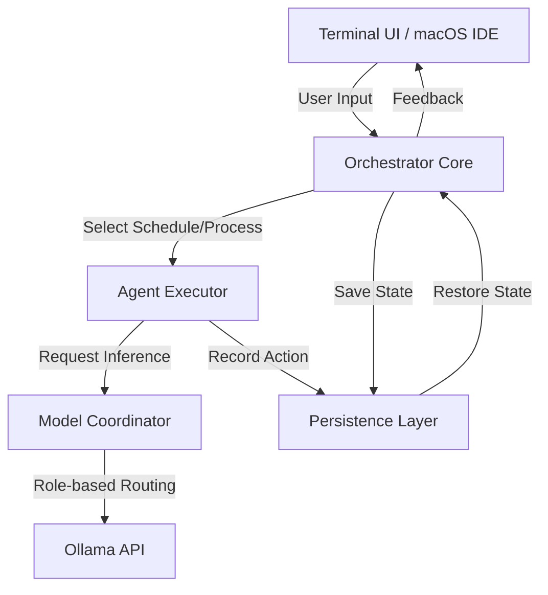

# System Architecture — OllamaBot

## Overview

OllamaBot is a professional-grade agentic system designed for local AI-assisted software engineering. It employs a multi-model orchestration strategy, dividing complex tasks into manageable schedules and processes executed by specialized AI models.

## Core Component Diagram

## Orchestration Flow (UOP)

OllamaBot follows the **Unified Orchestration Protocol (UOP)**, which defines 5 schedules, each containing 3 processes.

### 1. The 5-Schedule Pipeline

1.  **Knowledge**: Research, Crawl, Retrieve
2.  **Plan**: Brainstorm, Clarify, Plan
3.  **Implement**: Implement, Verify, Feedback
4.  **Scale**: Scale, Benchmark, Optimize
5.  **Production**: Analyze, Systemize, Harmonize

### 2. Navigation Rules

The Orchestrator enforces strict state transitions (P1 ↔ P2 ↔ P3):
- **Initial → P1**: Mandatory start.
- **P1 → {P1, P2}**: Planning or execution.
- **P2 → {P1, P2, P3}**: Refinement or finalization.
- **P3 → {P2, P3, Terminate}**: Completion of schedule.

## Pre-Orchestration Planner

Before any orchestration schedules begin, the **Planner** runs a pre-schedule phase to decompose the user task into an actionable roadmap.

- **Phase**: Pre-Schedule (Runs BEFORE Knowledge phase).
- **Inputs**: User prompt + current file tree.
- **Outputs**: 
  - **Subtasks List**: Atomic work units.
  - **Execution Sequence**: Dependency-aware ordering (topological sort).
  - **Risk Labels**: Identifies high-risk changes (e.g., destructive operations).
- **Downstream**: The generated plan feeds directly into the **Knowledge** and **Plan** schedules, providing the baseline context for research and detailed technical planning.

## Multi-Model Strategy

The **Model Coordinator** routes tasks to the most efficient model based on role and system resources (RAM Tier):

| Role | Default Model | Intent |
|------|---------------|--------|
| **Orchestrator** | Qwen3 (32B) | Decision making, navigation |
| **Researcher** | Command-R (35B) | Information gathering, RAG |
| **Coder** | Qwen2.5-Coder (32B) | File edits, terminal commands |
| **Vision** | Qwen3-VL (32B) | UI/UX inspection, screenshots |

## Persistence & Portability

OllamaBot uses the **Unified Session Format (USF)** to ensure that work can be handed off between the CLI, IDE, and remote workers without data loss.

- **SQLite WAL**: Local high-speed job scheduling.
- **USF JSON**: Content-addressed artifacts and state snapshots.
- **Git Integration**: Automatic commits and branch management for session recovery.

## Context Management

The `ContextManager` uses a priority-based token budget to maximize model performance within limited context windows:

- **Task (25%)**: Current goal and instructions.
- **Files (33%)**: Relevant source code.
- **Project (16%)**: Tree structure and symbol maps.
- **History (12%)**: Recent agent actions.
- **Memory (12%)**: Learned patterns and past successes.
- **Errors (6%)**: Known issue warnings.

---
**Document Status**: Draft  
**Architecture Version**: 2.0  
**Last Updated**: 2026-02-10
