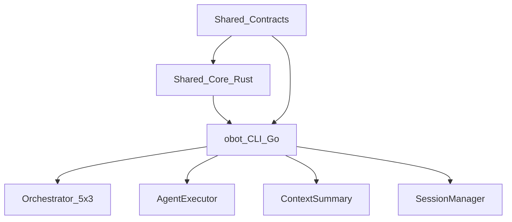

# obot CLI Master Plan (gpt-1)

## Executive Summary
Harmonization master plan for the obot CLI (Go, cross-platform). The CLI adopts a Shared Core Library architecture with contract-first rollout. The shared Rust core becomes the single source of truth for orchestration, context, models, sessions, tools, and errors. The CLI remains a platform-optimized Go adapter over the shared core, retaining its canonical 5-schedule x 3-process orchestration as the authoritative state machine.

## Consolidated Decisions
- Shared Core Library (Rust) with cgo bindings for Go CLI integration.
- Contract-first schemas for config, tools, context, sessions, and errors.
- CLI 5 schedules x 3 processes is the canonical orchestration state machine.
- Unified config root at `~/.ollamabot/` with migration from `~/.config/obot/config.json`.
- Unified tool registry with canonical IDs plus alias mapping.

## Target Architecture


## CLI-Specific Integration Points

### Go Bindings (cgo)
- cgo interface to shared Rust core via C ABI.
- Goroutine-safe wrappers for concurrent agent execution.
- Streaming response bridging from Rust to Go channels.

### Key CLI Files for Alignment
- `internal/orchestrate/orchestrator.go` — 5-schedule x 3-process state machine; becomes thin wrapper over core-orchestration.
- `internal/agent/agent.go` — agent execution; maps to shared core execution engine.
- `internal/context/summary.go` — context construction; replaced by core-context.
- `internal/ollama/client.go` — Ollama API client; replaced by core-ollama.
- `internal/session/session.go` — directory-based sessions with bash restoration; replaced by core-session.
- `internal/tier/detector.go` — RAM-based tier detection; replaced by core-models.

### Canonical Orchestration (CLI is Authoritative)
- 5 Schedules: Knowledge, Plan, Implement, Scale, Production.
- 3 Processes per schedule with strict adjacent navigation (P1 <-> P2 <-> P3).
- Human consultation: optional for Clarify, mandatory for Feedback, 60s timeout with AI fallback.
- Flow code tracking for session state persistence.

## Shared Contracts
- `config.yaml` schema (models, tiers, quality presets, orchestration, context).
- Tool registry schema (canonical IDs + aliases).
- Context protocol schema (token budgets, compression, memory).
- Session format schema (flow code, steps, checkpoints).
- Error taxonomy schema (codes + remediation).

## Shared Core Modules
- `core-ollama`: streaming client and model management.
- `core-models`: tier detection + intent routing.
- `core-context`: token budgets, compression, memory, error learning.
- `core-orchestration`: 5x3 schedules, navigation rules, flow code.
- `core-tools`: registry, validation, alias mapping.
- `core-session`: sessions, checkpoints, recurrence relations.
- `core-errors`: error taxonomy and structured errors.
- `core-stats`: usage, savings, latency.

## Shared Data Formats
```
~/.ollamabot/
  config.yaml
  tools/registry.yaml
  context/schema.json
  sessions/
  errors/taxonomy.yaml
project/.obot/
  config.yaml
  bots/
  context/
  templates/
  rules.obotrules
```

## Features CLI Must Adopt from IDE
- OBot system (.obotrules, bots, context, templates) — parse and apply project rules.
- @mention resolution for context injection in prompts.
- Multi-model delegation (coder/researcher/vision routing).
- Web search and git tool parity with IDE tool set.
- Checkpoint system for save/restore of code states.

## Features CLI Provides to Shared Ecosystem
- Quality presets (fast/balanced/thorough) as the canonical implementation.
- 5-schedule x 3-process orchestration as the authoritative state machine.
- Flow code tracking and session persistence with bash restoration scripts.
- Cost savings tracking and reporting.
- Line-range edits and dry-run/diff previews.
- Human consultation protocol with timeout behavior.
- RAM-based tier detection and model selection.

## Implementation Phases (CLI Track, 12 weeks)

### Phase 0: Contracts (Weeks 1-2)
- Finalize schemas (config, tools, context, sessions, errors).
- Build schema validators and golden tests.
- Generate shared docs and migration notes.
- Map `~/.config/obot/config.json` keys to unified config schema.

### Phase 1: Core Services (Weeks 3-4)
- Integrate core-ollama to replace internal Ollama client.
- Integrate core-models to replace tier detector.
- Integrate core-context to replace context summary construction.
- Wire core-orchestration to replace orchestrator.go state machine.

### Phase 2: Go Bindings (Weeks 5-6)
- Build cgo wrappers around C ABI from shared Rust core.
- Replace duplicated logic in CLI with shared core calls.
- Ensure goroutine safety for concurrent agent execution.
- Maintain temporary bridge mode for any gaps during migration.

### Phase 3: Feature Parity (Weeks 7-9)
- Add .obotrules parsing and project rule application.
- Add @mention resolution in CLI prompts.
- Add multi-model delegation support (coder/researcher/vision).
- Add web search tool and expand git tool coverage.
- Add checkpoint save/restore system.

### Phase 4: Testing + Release (Weeks 10-12)
- Cross-product session portability tests (import IDE sessions into CLI).
- Compatibility harness for schemas and tool calls.
- Performance benchmarks across platforms (macOS, Linux).
- Documentation, migration guides, and release validation.
- Verify bash restoration scripts work with new session format.

## Testing and Validation
- Unit tests in core for all shared logic.
- Golden prompt/render tests for tool calls.
- Cross-platform session import/export tests.
- Performance budgets: no >5% regression in CLI throughput.
- Test all 5 schedules x 3 processes with navigation rules.
- Verify human consultation timeouts and AI fallback.

## Migration Plan
- Migrate `~/.config/obot/config.json` to `~/.ollamabot/config.yaml` with automatic backup.
- Convert existing directory-based sessions to shared session format.
- Preserve backward compatibility for existing bash restoration scripts.
- Provide `obot migrate` CLI command for one-step migration.

## Risks and Mitigations
- cgo complexity: start with minimal C ABI surface and grow incrementally.
- Performance regression: benchmark before/after and allow Go-native fast paths.
- User disruption: staged rollout with clear migration guides and `obot migrate` command.
- Cross-platform builds: ensure Rust core compiles for macOS and Linux targets.

## Success Metrics
- 100% shared config portability between CLI and IDE.
- 90% feature parity for core workflows.
- Session portability IDE -> CLI without loss.
- Test coverage >80% in shared core.
- No >5% performance regression in CLI.
- All 5x3 orchestration schedules functional after migration.
