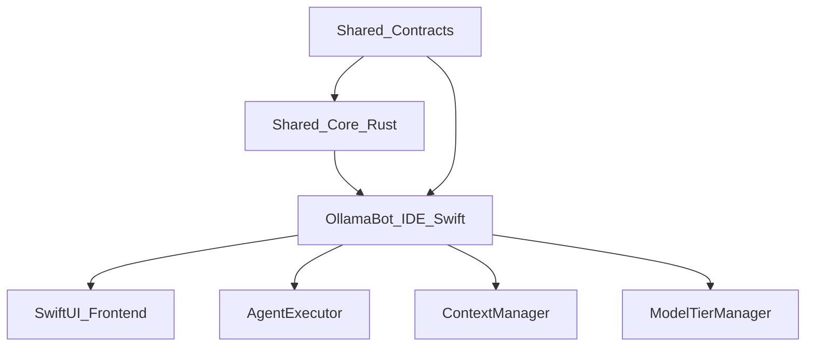

# OllamaBot IDE Master Plan (gpt-1)

## Executive Summary
Harmonization master plan for the OllamaBot IDE (Swift/SwiftUI, macOS). The IDE adopts a Shared Core Library architecture with contract-first rollout. The shared Rust core becomes the single source of truth for orchestration, context, models, sessions, tools, and errors. The IDE remains a platform-optimized SwiftUI adapter over the shared core.

## Consolidated Decisions
- Shared Core Library (Rust) with C ABI + Swift Package wrapper for IDE integration.
- Contract-first schemas for config, tools, context, sessions, and errors.
- CLI 5 schedules x 3 processes is the canonical orchestration state machine; IDE modes map into it.
- Unified config root at `~/.ollamabot/` with migration from IDE UserDefaults.
- Unified tool registry with canonical IDs plus alias mapping.

## Target Architecture


## IDE-Specific Integration Points

### Swift Bindings
- C ABI surface from shared Rust core exposed via Swift Package wrapper.
- Async/await bridging for streaming responses.
- Memory-safe wrappers around FFI pointers.

### Key IDE Files for Alignment
- `Sources/Agent/AgentExecutor.swift` — agent orchestration, maps to shared core orchestration engine.
- `Sources/Services/ContextManager.swift` — token budgeting, compression, memory; replaced by core-context.
- `Sources/Services/ModelTierManager.swift` — tier detection, intent routing; replaced by core-models.
- `Sources/Services/OllamaService.swift` — streaming client; replaced by core-ollama.
- `Sources/Services/OBotService.swift` — .obotrules, bots, context snippets, templates.
- `Sources/Services/MentionService.swift` — @mention resolution for context injection.
- `Sources/Services/CheckpointService.swift` — checkpoint/restore system.

### IDE Mode Mapping to Canonical Schedules
- Infinite Mode: Plan + Implement schedules.
- Explore Mode: Production schedule with reflection loops.
- Cycle Mode: full 5-schedule orchestration (Knowledge, Plan, Implement, Scale, Production).

## Shared Contracts
- `config.yaml` schema (models, tiers, quality presets, orchestration, context).
- Tool registry schema (canonical IDs + aliases).
- Context protocol schema (token budgets, compression, memory).
- Session format schema (flow code, steps, checkpoints).
- Error taxonomy schema (codes + remediation).

## Shared Core Modules
- `core-ollama`: streaming client and model management.
- `core-models`: tier detection + intent routing.
- `core-context`: token budgets, compression, memory, error learning.
- `core-orchestration`: 5x3 schedules, navigation rules, flow code.
- `core-tools`: registry, validation, alias mapping.
- `core-session`: sessions, checkpoints, recurrence relations.
- `core-errors`: error taxonomy and structured errors.
- `core-stats`: usage, savings, latency.

## Shared Data Formats
```
~/.ollamabot/
  config.yaml
  tools/registry.yaml
  context/schema.json
  sessions/
  errors/taxonomy.yaml
project/.obot/
  config.yaml
  bots/
  context/
  templates/
  rules.obotrules
```

## Features IDE Must Adopt from CLI
- Quality presets (fast/balanced/thorough).
- Flow code tracking and session persistence UI.
- Cost savings dashboard.
- Line-range edits and dry-run/diff previews.
- Human consultation UI with timeout behavior (60s timeout, AI fallback).

## Features IDE Provides to Shared Ecosystem
- OBot system (.obotrules, bots, context, templates).
- @mention resolution for context injection (14+ mention types).
- Multi-model delegation (Orchestrator, Coder, Researcher, Vision).
- Checkpoint system with save/restore code states.
- Composer (multi-file agent) with accept/reject per file.
- Context token indicator with visual progress ring.
- Image support with drag/drop and vision model routing.

## Implementation Phases (IDE Track, 12 weeks)

### Phase 0: Contracts (Weeks 1-2)
- Finalize schemas (config, tools, context, sessions, errors).
- Build schema validators and golden tests.
- Generate shared docs and migration notes.
- Map IDE UserDefaults keys to unified config schema.

### Phase 1: Core Services (Weeks 3-4)
- Integrate core-ollama to replace OllamaService streaming logic.
- Integrate core-models to replace ModelTierManager.
- Integrate core-context to replace ContextManager token budgeting.
- Wire core-orchestration into AgentExecutor.

### Phase 2: Swift Bindings (Weeks 5-6)
- Build Swift Package wrapper around C ABI.
- Replace duplicated logic in IDE with shared core calls.
- Ensure async/await bridging works for streaming.
- Add fallback paths for any gaps during migration.

### Phase 3: Feature Parity (Weeks 7-9)
- Add quality presets UI (fast/balanced/thorough selector).
- Add flow code tracking and session persistence views.
- Add cost savings dashboard panel.
- Add line-range edit support and dry-run/diff previews.
- Add human consultation UI with timeout behavior.

### Phase 4: Testing + Release (Weeks 10-12)
- Cross-product session portability tests (import CLI sessions into IDE).
- Compatibility harness for schemas and tool calls.
- Performance benchmarks on 8GB, 16GB, 32GB, 64GB RAM configs.
- Documentation, migration guides, and release validation.
- Benchmark against Cursor and Windsurf.

## Testing and Validation
- Unit tests in core for all shared logic.
- Golden prompt/render tests for tool calls.
- Cross-platform session import/export tests.
- Performance budgets: no >5% regression in IDE responsiveness.
- Test all @mention types, checkpoint save/restore, Composer multi-file generation.

## Migration Plan
- Export IDE UserDefaults to `~/.ollamabot/config.yaml` on first run.
- Convert existing in-memory sessions to shared session format.
- Preserve backward compatibility for existing .obot project configs.

## Risks and Mitigations
- FFI complexity: start with minimal C ABI surface and grow incrementally.
- Performance regression: benchmark before/after and allow Swift-native fast paths.
- User disruption: staged rollout with clear migration guides.
- SwiftUI threading: ensure all FFI calls dispatch off main thread.

## Success Metrics
- 100% shared config portability between CLI and IDE.
- 90% feature parity for core workflows.
- Session portability CLI -> IDE without loss.
- Test coverage >80% in shared core.
- No >5% performance regression in IDE.
- All 14+ @mention types functional after migration.
