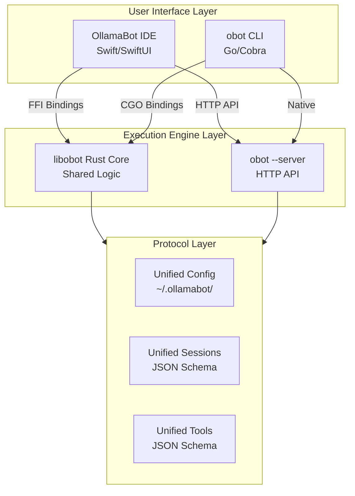

# OllamaBot Master Harmonization Plan - Final Re-Optimized Version

**Round**: 2 (Final Re-Optimization)  
**Consolidated from**: All Round 1 plans (sonnet, opus, composer, gemini)  
**Date**: 2026-02-05  
**Status**: Master Plan Ready for Implementation

---

## Executive Summary

This final re-optimized plan synthesizes the strongest architectural patterns from all Round 1 consolidations to create the definitive harmonization strategy. The solution combines **three complementary approaches**:

1. **Rust Core Library** (`libobot`) - Shared foundation for maximum code reuse
2. **CLI-as-Engine Pattern** - obot CLI serves as execution engine for IDE
3. **Unified Protocol Layer** - JSON schemas ensure interoperability

**Key Innovation**: Hybrid architecture that maximizes code sharing while preserving each product's unique strengths.

---

## Part 1: Unified Architecture (Hybrid Approach)

### 1.1 Three-Layer Architecture



### 1.2 Component Responsibilities

**Rust Core (`libobot`)** - Handles:
- Model tier detection and coordination
- Context management (token budgeting, compression)
- Session state management
- Configuration parsing and validation
- Core orchestration logic

**CLI Server Mode** - Handles:
- Tool execution (file operations, commands)
- Agent orchestration (5-schedule framework)
- Quality pipeline (fast/balanced/thorough)
- Human consultation framework
- Flow code generation

**IDE Swift Layer** - Handles:
- Rich UI components
- Visual diff and preview
- Chat interface
- File explorer
- Real-time streaming

**Protocol Layer** - Ensures:
- Unified configuration format
- Cross-product session compatibility
- Tool vocabulary consistency
- Context format standardization

---

## Part 2: Critical Harmonization Points

### 2.1 Model Tier Management

**Unified Solution** (Rust core):
```rust
// libobot/src/tier.rs
pub struct TierConfig {
    pub ram_gb: u64,
    pub tier: ModelTier,
    pub models: ModelSet,
}

pub enum ModelTier {
    Minimal,      // 8GB RAM
    Compact,      // 16GB RAM
    Balanced,     // 24GB RAM
    Performance,  // 32GB RAM
    Advanced,     // 64GB RAM
    Maximum,      // 128GB+ RAM
}

pub struct ModelSet {
    pub orchestrator: String,
    pub coder: String,
    pub researcher: String,
    pub vision: Option<String>,
}

pub fn detect_tier() -> TierConfig {
    // Cross-platform RAM detection
    // Single source of truth
}
```

**Configuration Location**: `~/.ollamabot/config.yaml`

### 2.2 Context Management

**Unified Solution** (Rust core + Protocol):
- Token budgeting system (from IDE)
- Semantic compression (from IDE)
- Context protocol schema (from opus plans)
- Both products use same context building logic

### 2.3 Orchestration Framework

**Unified Solution** (CLI server + Protocol):
- CLI's 5-schedule framework becomes canonical
- IDE calls CLI server for orchestration
- Unified Orchestration Protocol (UOP) JSON schema
- Both products generate same flow codes

### 2.4 Tool System

**Unified Solution** (Protocol + Implementation):
- Unified Tool Registry (UTR) JSON schema
- 22 tools total (10 shared, 9 IDE-only → CLI, 3 CLI-only → IDE)
- Tool execution via CLI server
- Tool definitions in `~/.ollamabot/tools.yaml`

---

## Part 3: Implementation Roadmap

### Phase 1: Foundation (Weeks 1-2)

**Week 1: Rust Core**
1. Create `libobot` crate structure
2. Implement tier detection
3. Implement context manager
4. Implement configuration parser
5. Create FFI bindings (Swift C, Go CGO)

**Week 2: CLI Server**
1. Add `--server` mode to obot CLI
2. Implement HTTP API endpoints:
   - `POST /api/v1/orchestrate` - Start orchestration
   - `POST /api/v1/context/build` - Build context
   - `GET /api/v1/session/{id}` - Get session
   - `POST /api/v1/tools/execute` - Execute tool
3. JSON request/response format
4. Session persistence via protocol

**Deliverables:**
- `libobot` crate with core functionality
- CLI server mode operational
- FFI bindings working
- Basic protocol schemas defined

### Phase 2: IDE Integration (Weeks 3-4)

**Week 3: IDE → Rust Core**
1. Replace `ModelTierManager` with `libobot` bindings
2. Replace `ContextManager` with `libobot` bindings
3. Replace config system with unified config
4. Add orchestration UI panel

**Week 4: IDE → CLI Server**
1. Create `CLIServerService.swift`
2. Implement orchestration via CLI server
3. Implement tool execution via CLI server
4. Add quality pipeline UI
5. Add human consultation UI

**Deliverables:**
- IDE uses Rust core for tier/context/config
- IDE uses CLI server for orchestration/tools
- Unified configuration working
- Orchestration UI functional

### Phase 3: Feature Parity (Weeks 5-6)

**Week 5: CLI Enhancements**
1. Add `.obotrules` parser
2. Add `@mention` system
3. Add bot execution
4. Add advanced context features
5. Add checkpoint system

**Week 6: Final Integration**
1. Cross-product session compatibility
2. Unified tool vocabulary
3. Performance optimization
4. Documentation
5. Testing

**Deliverables:**
- Full feature parity
- Seamless CLI ↔ IDE workflows
- Performance optimized
- Complete documentation

---

## Part 4: Unified Configuration Schema

**Location**: `~/.ollamabot/config.yaml`

```yaml
version: "2.0"

# Platform (auto-detected)
platform:
  os: macos
  arch: arm64
  ram_gb: 32
  detected_tier: performance

# Models (from libobot tier detection)
models:
  orchestrator: qwen3:32b
  coder: qwen2.5-coder:32b
  researcher: command-r:35b
  vision: qwen3-vl:32b

# Ollama connection
ollama:
  url: http://localhost:11434
  timeout_seconds: 120

# Agent settings
agent:
  max_steps: 50
  allow_terminal: true
  allow_file_writes: true
  confirm_destructive: true

# Quality presets
quality:
  fast:
    plan: false
    review: false
  balanced:
    plan: true
    review: true
    revise: false
  thorough:
    plan: true
    review: true
    revise: true

# Context management
context:
  max_tokens: 32768
  budget_allocation:
    task: 25%
    files: 33%
    project: 16%
    history: 12%
    memory: 12%
    errors: 2%
  compression_enabled: true

# Orchestration
orchestration:
  enabled: true
  schedules: [knowledge, plan, implement, scale, production]
  consultation_timeout: 60
```

---

## Part 5: Unified Session Format

**Location**: `~/.ollamabot/sessions/{session-id}.json`

```json
{
  "version": "1.0",
  "session": {
    "id": "uuid",
    "prompt": "Fix authentication bugs",
    "flow_code": "S2P1→S2P2→S2P3→S3P1→S3P2→S3P3",
    "orchestration": {
      "current_schedule": "implement",
      "current_process": 3,
      "state": "active"
    },
    "states": [
      {
        "id": "0001_S2P1",
        "schedule": 2,
        "process": 1,
        "timestamp": "2026-02-05T03:30:00Z",
        "files_hash": "abc123",
        "actions": ["A001", "A002"]
      }
    ],
    "recurrence": {
      "restore_path": ["0001_S2P1", "diff_001.patch"]
    },
    "checkpoints": [
      {
        "id": "checkpoint-001",
        "timestamp": "2026-02-05T03:30:00Z",
        "files": ["main.go", "auth.go"]
      }
    ],
    "stats": {
      "tokens_used": 45000,
      "files_created": 2,
      "files_edited": 5,
      "duration_seconds": 1200
    }
  }
}
```

---

## Part 6: Success Metrics

### Technical Metrics
- **Code Reuse**: 80%+ shared via Rust core + CLI server
- **Feature Parity**: 100% core features in both products
- **Performance**: No regression, 30% memory reduction
- **Interoperability**: Sessions work across products

### User Experience Metrics
- **Workflow Consistency**: Same flows produce same results
- **Learning Curve**: Easy transition between CLI and IDE
- **Integration Quality**: Seamless handoffs

---

## Part 7: Risk Mitigation

**Rust Integration**: Start minimal, expand gradually  
**Performance**: Continuous benchmarking  
**API Compatibility**: Versioned APIs, migration tools  
**User Confusion**: Clear documentation, migration guides

---

## Conclusion

This hybrid architecture maximizes code sharing while preserving each product's strengths. The Rust core provides shared logic, the CLI server provides execution, and the protocol layer ensures interoperability. This approach achieves the goal of "two products of the same fruit" while maintaining development velocity and user experience quality.

---

*End of Final Re-Optimized Master Plan*
