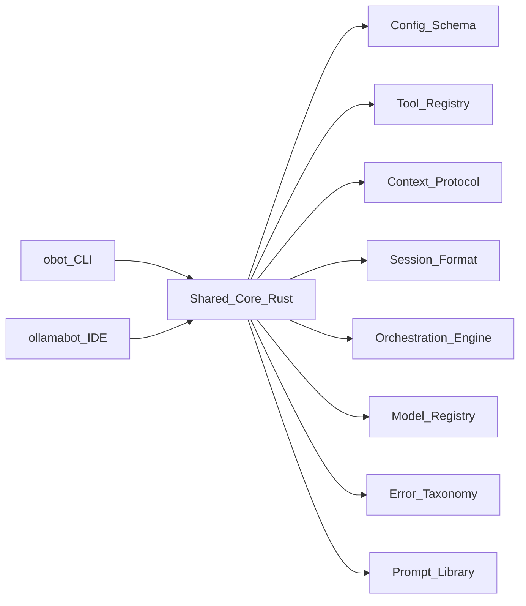

# Master Plan: gpt-1 (CLI)

**Agent ID:** gpt-1
**Source Round:** 1
**Source File:** plans_1/plan-1-gpt-1.md
**Recovery Status:** RECOVERED
**Recovery Date:** 2026-02-06
**Product:** obot CLI (Go)

---

# OllamaBot + obot Harmonization Master Plan (Round 1, Shared Core)

## Executive Summary
This consolidated plan harmonizes obot (CLI) and OllamaBot (IDE) using a shared Rust core with Swift/Go bindings. The shared core enforces identical orchestration and agent flows while keeping medium-specific UX. It standardizes configuration, tool registry, context protocol, session format, and error taxonomy, and defines phased delivery to reach feature parity and workflow portability.

## Consolidated Gaps (Round 0)
- Duplicate core services (Ollama client, tier detection, context building, model coordination).
- Divergent orchestration flows (CLI 5x3 schedules vs IDE infinite/explore/cycle modes).
- Tool/action vocabulary mismatch and inconsistent parameter formats.
- Separate configuration stores (UserDefaults vs ~/.config/obot).
- Non-portable sessions and checkpoints.
- Feature asymmetry (quality presets, cost tracking, line-range edits, mentions, OBot rules).

## Target Architecture (Shared Core)
Shared Rust core provides the canonical behavior; CLI and IDE are adapters.



### Shared Core Modules
- `core-config`: global + project config, migration, hot reload.
- `core-models`: tier detection, intent routing, multi-model coordination.
- `core-context`: token budgets, compression, memory, error patterns.
- `core-orchestration`: 5 schedules x 3 processes, navigation rules, flow code.
- `core-tools`: tool registry, alias mapping, parameter validation.
- `core-session`: unified session + checkpoint formats, recurrence relations.
- `core-errors`: error taxonomy and structured error reporting.
- `core-prompts`: shared prompt templates and rendering.
- `core-stats`: usage/cost tracking and performance metrics.

Bindings:
- Go: cgo for CLI.
- Swift: C ABI + Swift Package wrapper for IDE.

## Shared Data Formats (Single Source of Truth)
### Global and project config
```
~/.ollamabot/
  config.yaml
  models.yaml
  context.yaml
  tools/registry.yaml
  prompts/
  sessions/
project/.obot/
  config.yaml
  bots/
  context/
  templates/
  rules.obotrules
```

### Tool registry (normalized names + aliases)
- Canonical IDs (examples): `file.read`, `file.write`, `file.edit`, `system.run`, `git.status`, `web.search`, `ai.delegate.coder`.
- Alias mapping for legacy names (`write_file`, `CreateFile`, etc).

### Context protocol
- Token budget allocation per section (task, files, project, history, memory, errors).
- Compression rules, relevance scoring, and tool result buffering.

### Session format
- Flow code (`S1P123S2P12`) and schedule/process history.
- Checkpoints with file hashes and restore metadata.
- Cross-platform import/export (CLI <-> IDE).

### Error taxonomy
- Shared error codes and user-facing remediation strings.

## Orchestration and Agent Flow
### Canonical orchestration
- Use CLI 5 schedules x 3 processes as the canonical state machine.
- Navigation rules: P1 -> P1|P2, P2 -> P1|P2|P3, P3 -> P2|P3|terminate.
- Human consultation: optional for Clarify, mandatory for Feedback, 60s timeout with AI fallback.
- Flow code tracking shared across CLI and IDE.

### IDE mode mapping
- Infinite Mode: Plan + Implement schedules.
- Explore Mode: Production schedule with reflection and systemization loops.
- Cycle Mode: Full 5-schedule orchestration with shared state.

### Agent execution protocol
- Shared tool registry + action mapping.
- Shared serialization for steps, tool calls, and results.

## Feature Parity Priorities
### CLI -> IDE
- Quality presets (fast/balanced/thorough).
- Flow code tracking and session persistence UI.
- Cost savings tracking.
- Line-range edits and dry-run/diff previews.
- Human consultation UI with timeout behavior.

### IDE -> CLI
- OBot system (.obotrules, bots, context, templates).
- @mention resolution for context injection.
- Multi-model delegation (coder/researcher/vision).
- Web search and git tool parity.
- Checkpoint system.

## Implementation Phases (12 weeks)
### Phase 1: Foundation (Weeks 1-2)
- Define shared schemas (config, tools, context, sessions, errors).
- Create Rust workspace + C ABI.
- Build migration tooling for existing config + session formats.

### Phase 2: Core Services (Weeks 3-4)
- Implement core modules: config, models, context, session, orchestration.
- Add prompt library and error taxonomy.

### Phase 3: Product Integration (Weeks 5-6)
- Wire Go CLI to shared core (cgo).
- Wire Swift IDE to shared core (C ABI + Swift wrapper).
- Begin feature parity ports that depend on shared core.

### Phase 4: Feature Parity (Weeks 7-9)
- CLI: OBot rules, mentions, multi-model, checkpoints, web/git tools.
- IDE: quality presets, flow code, line-range edits, dry-run/diff, cost tracking.

### Phase 5: Testing and Release (Weeks 10-12)
- Cross-platform compatibility harness.
- Golden prompt/render tests for tool calls.
- Performance benchmarks and regression gates.
- Documentation, migration guides, and release validation.

## Testing and Tooling
- Unit tests in Rust core for all shared logic.
- Integration tests for CLI and IDE workflows.
- Compatibility tests for shared schemas and session portability.
- Golden outputs for prompts and tool calls.
- CI for Go + Swift + Rust with performance gates.

## Migration Plan
- Migrate `~/.config/obot/config.json` to `~/.ollamabot/config.yaml` with backup.
- Export IDE UserDefaults to shared config on first run.
- Convert existing sessions to shared format with import/export tools.
- Provide `obot config migrate` and IDE migration UI.

## Risks and Mitigations
- FFI complexity: start with stable C ABI and minimal surface area.
- Performance regression: benchmark before/after and allow platform-specific fast paths.
- User confusion: staged rollouts and clear migration docs.

## Success Metrics
- 100% shared config portability between CLI and IDE.
- 90% feature parity for core workflows.
- Session portability CLI <-> IDE without loss.
- Test coverage >80% in shared core.
- No >5% performance regression.

## Key Files for Alignment
- `../obot/internal/orchestrate/orchestrator.go`
- `../obot/internal/agent/agent.go`
- `../obot/internal/config/config.go`
- `../obot/internal/context/summary.go`
- `../ollamabot/Sources/Agent/AgentExecutor.swift`
- `../ollamabot/Sources/Agent/CycleAgentManager.swift`
- `../ollamabot/Sources/Services/ContextManager.swift`
- `../ollamabot/Sources/Services/ModelTierManager.swift`
- `../ollamabot/Sources/Services/OBotService.swift`
