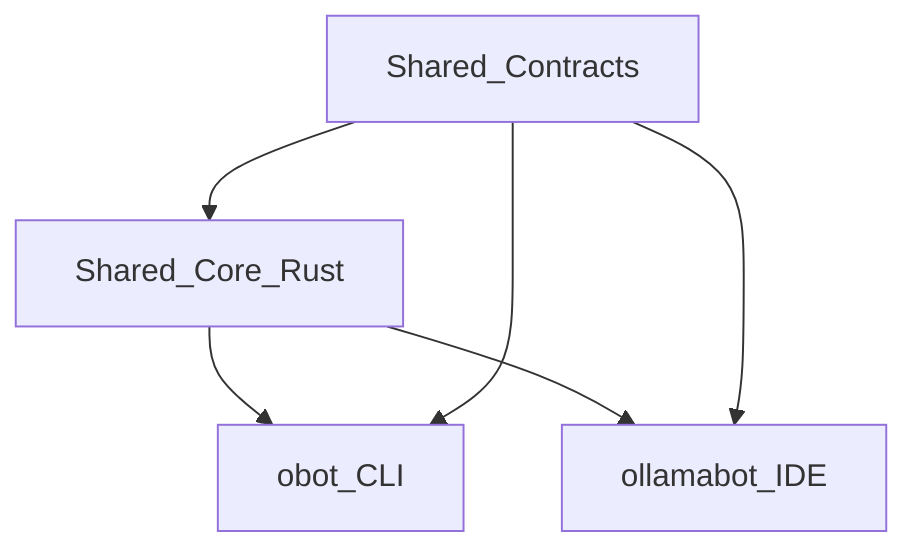

# OllamaBot + obot Harmonization Master Plan (Round 2, Shared Core)

## Executive Summary
Round 2 consolidation confirms the Shared Core Library architecture while adopting a contract-first rollout to reduce risk. The shared Rust core becomes the single source of truth for orchestration, context, models, sessions, tools, and errors. CLI and IDE remain platform-optimized adapters, with a temporary CLI bridge mode available until core bindings reach parity.

## Consolidated Decisions (Round 2)
- Shared Core Library (Rust) with C ABI bindings for Swift and cgo for Go.
- Contract-first schemas for config, tools, context, sessions, and errors.
- CLI 5 schedules x 3 processes is the canonical orchestration state machine.
- Unified config root at `~/.ollamabot/` with migration from `~/.config/obot` and IDE UserDefaults.
- Unified tool registry with canonical IDs plus alias mapping.

## Target Architecture


### Shared Contracts
- `config.yaml` schema (models, tiers, quality presets, orchestration, context).
- Tool registry schema (canonical IDs + aliases).
- Context protocol schema (token budgets, compression, memory).
- Session format schema (flow code, steps, checkpoints).
- Error taxonomy schema (codes + remediation).

### Shared Core Modules
- `core-ollama`: streaming client and model management.
- `core-models`: tier detection + intent routing.
- `core-context`: token budgets, compression, memory, error learning.
- `core-orchestration`: 5x3 schedules, navigation rules, flow code.
- `core-tools`: registry, validation, alias mapping.
- `core-session`: sessions, checkpoints, recurrence relations.
- `core-errors`: error taxonomy and structured errors.
- `core-stats`: usage, savings, latency.

Bindings:
- Go: cgo for CLI.
- Swift: C ABI + Swift Package wrapper for IDE.

## Shared Data Formats
```
~/.ollamabot/
  config.yaml
  tools/registry.yaml
  context/schema.json
  sessions/
  errors/taxonomy.yaml
project/.obot/
  config.yaml
  bots/
  context/
  templates/
  rules.obotrules
```

## Orchestration and Agent Flow
- Canonical schedules: Knowledge, Plan, Implement, Scale, Production.
- Processes per schedule: 1 -> 2 -> 3 with strict adjacent navigation rules.
- DecisionEngine + ExecutionEngine split in both products.
- Human consultation: optional for Clarify, mandatory for Feedback, 60s timeout with AI fallback.
- IDE mode mapping:
  - Infinite Mode: Plan + Implement schedules.
  - Explore Mode: Production schedule with reflection loops.
  - Cycle Mode: full 5-schedule orchestration.

## Feature Parity Priorities
### CLI -> IDE
- Quality presets (fast/balanced/thorough).
- Flow code tracking and session persistence UI.
- Cost savings dashboard.
- Line-range edits and dry-run/diff previews.
- Human consultation UI with timeout behavior.

### IDE -> CLI
- OBot system (.obotrules, bots, context, templates).
- @mention resolution for context injection.
- Multi-model delegation (coder/researcher/vision).
- Web search and git tool parity.
- Checkpoint system.

## Implementation Phases (12 weeks)
### Phase 0: Contracts (Weeks 1-2)
- Finalize schemas (config, tools, context, sessions, errors).
- Build schema validators and golden tests.
- Generate shared docs and migration notes.

### Phase 1: Core Services (Weeks 3-4)
- Implement core modules: models, context, orchestration, session, tools, errors.
- Add prompt library and stats tracking.

### Phase 2: Bindings + Adoption (Weeks 5-6)
- Integrate cgo and Swift bindings.
- Replace duplicated logic in CLI and IDE with shared core.
- Maintain a temporary CLI bridge mode for gaps.

### Phase 3: Feature Parity (Weeks 7-9)
- CLI: OBot rules, mentions, multi-model, checkpoints, web/git tools.
- IDE: quality presets, flow code, line-range edits, dry-run/diff, cost tracking.

### Phase 4: Testing + Release (Weeks 10-12)
- Cross-product session portability tests.
- Compatibility harness for schemas and tool calls.
- Performance benchmarks and regression gates.
- Documentation, migration guides, and release validation.

## Testing and Validation
- Unit tests in core for all shared logic.
- Golden prompt/render tests for tool calls.
- Cross-platform session import/export tests.
- Performance budgets: no >5% regression in CLI or IDE.

## Migration Plan
- Migrate `~/.config/obot/config.json` to `~/.ollamabot/config.yaml` with backup.
- Export IDE UserDefaults to shared config on first run.
- Convert existing sessions to the shared format with import/export tools.

## Risks and Mitigations
- FFI complexity: start with minimal ABI surface and grow incrementally.
- Performance regression: benchmark before/after and allow platform-specific fast paths.
- User disruption: staged rollout and clear migration guides.

## Success Metrics
- 100% shared config portability between CLI and IDE.
- 90% feature parity for core workflows.
- Session portability CLI <-> IDE without loss.
- Test coverage >80% in shared core.
- No >5% performance regression.

## Key Files for Alignment
- `../obot/internal/orchestrate/orchestrator.go`
- `../obot/internal/agent/agent.go`
- `../obot/internal/context/summary.go`
- `../ollamabot/Sources/Agent/AgentExecutor.swift`
- `../ollamabot/Sources/Services/ContextManager.swift`
- `../ollamabot/Sources/Services/ModelTierManager.swift`
