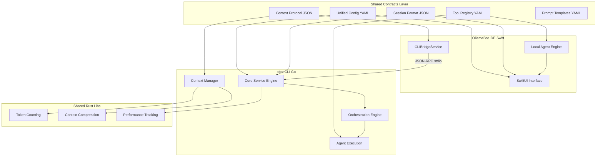

# OllamaBot Ecosystem Master Harmonization Plan (Round 2 - Re-Optimized)

**Agent:** Composer-4  
**Round:** 2 (Re-Optimized Consolidation)  
**Date:** 2026-02-05  
**Sources:** 18 Round 1 consolidation plans from Sonnet-2, Opus-1, Composer-2/3/5, Gemini-1/4/5, GPT-1, Unified Implementation Strategy

---

## Executive Summary

After analyzing 18 Round 1 consolidation plans, this re-optimized master plan synthesizes the strongest architectural approaches into a **pragmatic, risk-minimized harmonization strategy**. The consensus approach combines:

1. **Protocol-First Architecture** (from Sonnet-2, Gemini-5) - Shared schemas enable harmony without code duplication
2. **CLI-as-Engine Pattern** (from Opus-1, Gemini-1) - obot Go core becomes reusable service for IDE
3. **Selective Rust Components** (from GPT-1, Composer-5) - Performance-critical shared libraries only
4. **Progressive Harmonization** (from Sonnet-2, Unified Strategy) - Phase-based rollout with backward compatibility

**Core Principle:** Establish behavioral equivalence through shared contracts, allowing each platform to maintain its strengths while ensuring consistent user experience.

---

## Part 1: Synthesized Architecture Decision

### 1.1 The Hybrid "Contract + Service" Architecture

After analyzing all Round 1 approaches, the optimal architecture combines:



### 1.2 Architecture Rationale

**Why This Hybrid Approach:**

1. **Protocol-First (Primary)**: Shared YAML/JSON schemas ensure behavioral equivalence without forcing code sharing. Low risk, high compatibility.

2. **CLI-as-Service (Secondary)**: obot exposes server mode (`obot serve`) for complex orchestration tasks. IDE can delegate heavy workflows to proven CLI logic.

3. **Rust Libs (Selective)**: Only performance-critical, algorithm-heavy components (token counting, compression) use Rust. Reduces FFI complexity.

4. **Dual-Mode Support**: IDE maintains local agent engine for simple tasks, delegates to CLI for complex orchestration. Best of both worlds.

**Risk Mitigation:**
- No "big rewrite" - incremental changes
- Backward compatibility maintained
- Platform-specific optimizations preserved
- Gradual migration path

---

## Part 2: Unified Protocols (The Four Pillars)

### 2.1 Unified Configuration Schema (UCS) v2.0

**Location:** `~/.ollamabot/config.yaml` (unanimous consensus from all plans)

**Schema:**
```yaml
version: "2.0"
created_by: "obot" | "ollamabot"

# Model configuration (unified tier system)
models:
  tier_detection:
    auto: true
    thresholds:
      minimal: [0, 15]    # GB RAM
      compact: [16, 23]
      balanced: [24, 31]
      performance: [32, 63]
      advanced: [64, 999]
  
  orchestrator:
    default: qwen3:32b
    tier_mapping:
      minimal: qwen3:8b
      balanced: qwen3:14b
      performance: qwen3:32b
  
  coder:
    default: qwen2.5-coder:32b
    tier_mapping:
      minimal: deepseek-coder:1.3b
      balanced: qwen2.5-coder:14b
      performance: qwen2.5-coder:32b
  
  researcher:
    default: command-r:35b
    tier_mapping:
      minimal: command-r:7b
      performance: command-r:35b
  
  vision:
    default: qwen3-vl:32b
    tier_mapping:
      minimal: llava:7b
      performance: qwen3-vl:32b

# Orchestration settings
orchestration:
  default_mode: "orchestration"  # or "agent" for IDE-style
  schedules:
    - id: knowledge
      processes: [research, crawl, retrieve]
      model: researcher
    - id: plan
      processes: [brainstorm, clarify, plan]
      model: coder
      consultation:
        clarify: {type: optional, timeout: 60}
    - id: implement
      processes: [implement, verify, feedback]
      model: coder
      consultation:
        feedback: {type: mandatory, timeout: 300}
    - id: scale
      processes: [scale, benchmark, optimize]
      model: coder
    - id: production
      processes: [analyze, systemize, harmonize]
      model: [coder, vision]

# Context management (from IDE ContextManager)
context:
  max_tokens: 32768
  budget_allocation:
    task: 0.25
    files: 0.33
    project: 0.16
    history: 0.12
    memory: 0.12
    errors: 0.06
    reserve: 0.06
  compression:
    enabled: true
    strategy: semantic_truncate
    preserve: [imports, exports, signatures, errors]
  memory:
    enabled: true
    max_entries: 50
  error_learning:
    enabled: true
    threshold: 2

# Quality presets (from CLI)
quality:
  fast:
    iterations: 1
    verification: none
  balanced:
    iterations: 2
    verification: llm_review
  thorough:
    iterations: 3
    verification: expert_judge

# Platform-specific (ignored by other platform)
platforms:
  cli:
    verbose: true
    mem_graph: true
    color_output: true
  ide:
    theme: dark
    font_size: 14
    show_token_usage: true

# Ollama connection
ollama:
  url: http://localhost:11434
  timeout_seconds: 120
```

**Implementation:**
- Go: `gopkg.in/yaml.v3` with schema validation
- Swift: `Yams` library with schema validation
- Hot-reload support (file watchers)
- Migration tool: `obot config migrate` and IDE migration UI

### 2.2 Unified Tool Registry (UTR) v1.0

**Location:** `~/.ollamabot/tools/registry.yaml`

**Complete Tool Set (30 tools):**

```yaml
version: "1.0"

tools:
  # Core execution
  - id: think
    category: core
    platforms: [ide, cli]
    description: "Record internal reasoning"
    parameters: []
  
  - id: complete
    category: core
    platforms: [ide, cli]
    description: "Signal task completion"
    parameters: []
  
  - id: ask_user
    category: core
    platforms: [ide, cli]
    aliases: [consult_human, Consultation]
    description: "Request user input with timeout"
    parameters:
      - name: question
        type: string
        required: true
      - name: timeout_seconds
        type: integer
        required: false
        default: 60
  
  # File operations
  - id: file.read
    category: file
    platforms: [ide, cli]
    aliases: [read_file, ReadFile]
    description: "Read file contents"
    parameters:
      - name: path
        type: string
        required: true
  
  - id: file.write
    category: file
    platforms: [ide, cli]
    aliases: [write_file, CreateFile]
    description: "Write/create file"
    parameters:
      - name: path
        type: string
        required: true
      - name: content
        type: string
        required: true
    confirmation: conditional
  
  - id: file.edit
    category: file
    platforms: [ide, cli]
    aliases: [edit_file, EditFile]
    description: "Edit file (search/replace)"
    parameters:
      - name: path
        type: string
        required: true
      - name: old_string
        type: string
        required: true
      - name: new_string
        type: string
        required: true
    confirmation: conditional
  
  - id: file.edit_range
    category: file
    platforms: [ide, cli]
    description: "Edit file by line range"
    parameters:
      - name: path
        type: string
        required: true
      - name: start_line
        type: integer
        required: true
      - name: end_line
        type: integer
        required: true
      - name: content
        type: string
        required: true
    confirmation: conditional
  
  - id: file.delete
    category: file
    platforms: [ide, cli]
    aliases: [DeleteFile]
    description: "Delete file"
    parameters:
      - name: path
        type: string
        required: true
    confirmation: always
  
  - id: file.search
    category: file
    platforms: [ide, cli]
    aliases: [search_files]
    description: "Search file contents"
    parameters:
      - name: query
        type: string
        required: true
      - name: scope
        type: string
        required: false
  
  - id: file.list
    category: file
    platforms: [ide, cli]
    aliases: [list_directory]
    description: "List directory contents"
    parameters:
      - name: path
        type: string
        required: true
  
  # Command execution
  - id: system.run
    category: system
    platforms: [ide, cli]
    aliases: [run_command, RunCommand]
    description: "Execute shell command"
    parameters:
      - name: command
        type: string
        required: true
      - name: working_directory
        type: string
        required: false
  
  # Multi-model delegation
  - id: ai.delegate.coder
    category: delegation
    platforms: [ide, cli]
    aliases: [delegate_to_coder]
    requires_model: qwen2.5-coder
    description: "Delegate task to coding specialist"
    parameters:
      - name: task
        type: string
        required: true
      - name: context
        type: string
        required: false
  
  - id: ai.delegate.researcher
    category: delegation
    platforms: [ide, cli]
    aliases: [delegate_to_researcher]
    requires_model: command-r
    description: "Delegate task to research specialist"
    parameters:
      - name: task
        type: string
        required: true
  
  - id: ai.delegate.vision
    category: delegation
    platforms: [ide, cli]
    aliases: [delegate_to_vision]
    requires_model: qwen3-vl
    description: "Delegate task to vision specialist"
    parameters:
      - name: task
        type: string
        required: true
      - name: image_path
        type: string
        required: true
  
  # Web operations
  - id: web.search
    category: web
    platforms: [ide, cli]
    description: "Search the web"
    parameters:
      - name: query
        type: string
        required: true
  
  - id: web.fetch
    category: web
    platforms: [ide, cli]
    aliases: [fetch_url]
    description: "Fetch URL content"
    parameters:
      - name: url
        type: string
        required: true
  
  # Git operations
  - id: git.status
    category: git
    platforms: [ide, cli]
    description: "Get git status"
    parameters: []
  
  - id: git.diff
    category: git
    platforms: [ide, cli]
    description: "Get git diff"
    parameters:
      - name: path
        type: string
        required: false
  
  - id: git.commit
    category: git
    platforms: [ide, cli]
    description: "Commit changes"
    parameters:
      - name: message
        type: string
        required: true
    confirmation: conditional
  
  # Session management
  - id: checkpoint.save
    category: session
    platforms: [ide, cli]
    description: "Save checkpoint"
    parameters:
      - name: description
        type: string
        required: false
  
  - id: checkpoint.restore
    category: session
    platforms: [ide, cli]
    description: "Restore checkpoint"
    parameters:
      - name: checkpoint_id
        type: string
        required: true
```

**Implementation:**
- Both platforms validate tool calls against UTR schema
- Generate Ollama tool definitions from UTR
- Backward compatibility via alias mapping
- CLI priority: Implement missing tools (web.search, ai.delegate.*, file.edit_range)

### 2.3 Unified Context Protocol (UCP) v1.0

**Format:** JSON Schema for context serialization

**Schema:**
```json
{
  "$schema": "http://json-schema.org/draft-07/schema#",
  "title": "Unified Context Protocol",
  "type": "object",
  "properties": {
    "version": {"const": "1.0"},
    "context_id": {"type": "string", "format": "uuid"},
    "timestamp": {"type": "string", "format": "date-time"},
    "type": {"enum": ["orchestrator", "delegation", "specialist"]},
    
    "task": {
      "type": "object",
      "properties": {
        "original": {"type": "string"},
        "compressed": {"type": "string"},
        "intent": {"enum": ["coding", "research", "writing", "vision"]}
      }
    },
    
    "workspace": {
      "type": "object",
      "properties": {
        "path": {"type": "string"},
        "language": {"type": "string"},
        "file_count": {"type": "integer"}
      }
    },
    
    "files": {
      "type": "array",
      "items": {
        "type": "object",
        "properties": {
          "path": {"type": "string"},
          "content": {"type": "string"},
          "summary": {"type": "string"},
          "relevance": {"type": "number"},
          "line_count": {"type": "integer"}
        }
      }
    },
    
    "history": {
      "type": "object",
      "properties": {
        "steps": {"type": "array"},
        "summary": {"type": "string"}
      }
    },
    
    "memory": {
      "type": "object",
      "properties": {
        "relevant_memories": {"type": "array"},
        "error_patterns": {"type": "array"}
      }
    },
    
    "budget": {
      "type": "object",
      "properties": {
        "total_tokens": {"type": "integer"},
        "used_tokens": {"type": "integer"},
        "allocation": {
          "type": "object",
          "properties": {
            "task": {"type": "number"},
            "files": {"type": "number"},
            "project": {"type": "number"},
            "history": {"type": "number"},
            "memory": {"type": "number"},
            "errors": {"type": "number"}
          }
        }
      }
    }
  },
  "required": ["version", "context_id", "task", "budget"]
}
```

**Implementation:**
- Port IDE ContextManager logic to Go (`internal/context/manager.go`)
- Shared token counting via Rust lib (tiktoken-rs)
- Shared compression algorithm via Rust lib
- Cross-product context sharing enabled

### 2.4 Unified Session Protocol (USP) v1.0

**Location:** `~/.ollamabot/sessions/{session_id}/session.json`

**Schema:**
```json
{
  "$schema": "http://json-schema.org/draft-07/schema#",
  "title": "Unified Session Protocol",
  "type": "object",
  "properties": {
    "version": {"const": "1.0"},
    "session_id": {"type": "string", "format": "uuid"},
    "created_at": {"type": "string", "format": "date-time"},
    "updated_at": {"type": "string", "format": "date-time"},
    "platform_origin": {"enum": ["ide", "cli"]},
    
    "task": {
      "type": "object",
      "properties": {
        "original": {"type": "string"},
        "description": {"type": "string"},
        "status": {"enum": ["pending", "in_progress", "completed", "failed", "paused"]}
      }
    },
    
    "orchestration": {
      "type": "object",
      "properties": {
        "current_schedule": {"type": "integer", "minimum": 1, "maximum": 5},
        "current_process": {"type": "integer", "minimum": 1, "maximum": 3},
        "flow_code": {"type": "string", "pattern": "^(S[1-5]P[1-3]+)+$"},
        "schedule_counts": {"type": "object"},
        "navigation_history": {"type": "array"}
      }
    },
    
    "context": {
      "type": "object",
      "properties": {
        "workspace_path": {"type": "string"},
        "relevant_files": {"type": "array"},
        "token_usage": {"type": "integer"}
      }
    },
    
    "steps": {
      "type": "array",
      "items": {
        "type": "object",
        "properties": {
          "step_number": {"type": "integer"},
          "tool_id": {"type": "string"},
          "parameters": {"type": "object"},
          "result": {"type": "string"},
          "success": {"type": "boolean"},
          "timestamp": {"type": "string", "format": "date-time"}
        }
      }
    },
    
    "checkpoints": {
      "type": "array",
      "items": {
        "type": "object",
        "properties": {
          "id": {"type": "string"},
          "timestamp": {"type": "string", "format": "date-time"},
          "description": {"type": "string"},
          "git_commit": {"type": "string"}
        }
      }
    },
    
    "stats": {
      "type": "object",
      "properties": {
        "total_tokens": {"type": "integer"},
        "total_duration_ms": {"type": "integer"},
        "model_calls": {"type": "integer"},
        "files_modified": {"type": "integer"}
      }
    }
  },
  "required": ["version", "session_id", "created_at", "platform_origin", "task"]
}
```

**Implementation:**
- CLI: Export/import via `obot session export/import`
- IDE: Save/load via UnifiedSessionService
- Cross-platform compatibility: 100% session portability
- Restore scripts: CLI generates `restore.sh` for manual restoration

---

## Part 3: Implementation Roadmap

### Phase 1: Foundation (Weeks 1-3)

**Goal:** Establish shared contracts without breaking existing functionality

#### Week 1: Configuration System
- [ ] Create `~/.ollamabot/` directory structure
- [ ] Define YAML config schema (UCS v2.0)
- [ ] Implement config parsers in Swift and Go
- [ ] Build migration tool (`obot config migrate`)
- [ ] Add hot-reload support (file watchers)
- [ ] Test backward compatibility

#### Week 2: Tool Registry
- [ ] Define UTR v1.0 schema (30 tools)
- [ ] Create tool registry YAML
- [ ] Implement UTR validation in both platforms
- [ ] Build tool-to-action adapter layers
- [ ] Generate Ollama tool definitions from UTR
- [ ] Test behavioral equivalence

#### Week 3: Context Protocol
- [ ] Define UCP v1.0 JSON schema
- [ ] Port IDE ContextManager to Go
- [ ] Create Rust token counting lib (tiktoken-rs)
- [ ] Create Rust compression lib
- [ ] Implement context serialization/deserialization
- [ ] Test cross-platform context sharing

### Phase 2: CLI-as-Service (Weeks 4-5)

**Goal:** Enable IDE to delegate complex workflows to CLI

#### Week 4: obot Server Mode
- [ ] Implement `obot serve` command
- [ ] JSON-RPC over stdio protocol
- [ ] State streaming for real-time updates
- [ ] Session management API
- [ ] Error handling and recovery

#### Week 5: IDE Bridge Service
- [ ] Create `CLIBridgeService.swift`
- [ ] Implement JSON-RPC client
- [ ] Add orchestration delegation UI
- [ ] Stream CLI output to IDE
- [ ] Test CLI ↔ IDE communication

### Phase 3: Feature Parity (Weeks 6-8)

**Goal:** Close capability gaps between CLI and IDE

#### Week 6: CLI Enhancements
- [ ] Add web.search tool (DuckDuckGo integration)
- [ ] Implement ai.delegate.* tools (multi-model)
- [ ] Add file.edit_range tool (line-range editing)
- [ ] Port OBot system (.obotrules, mentions, bots)
- [ ] Add checkpoint system

#### Week 7: IDE Enhancements
- [ ] Add quality presets UI (fast/balanced/thorough)
- [ ] Implement flow code visualization
- [ ] Add cost savings tracking dashboard
- [ ] Implement dry-run/diff preview modes
- [ ] Add human consultation UI with timeout

#### Week 8: Session Portability
- [ ] Implement USP v1.0 in both platforms
- [ ] Add session export/import commands
- [ ] Create session restore scripts
- [ ] Test CLI ↔ IDE handoff
- [ ] Validate zero data loss

### Phase 4: Integration & Testing (Weeks 9-10)

**Goal:** Validate harmonization and optimize performance

#### Week 9: Behavioral Validation
- [ ] Run comprehensive cross-platform test suite
- [ ] Validate session format compatibility
- [ ] Test configuration migration paths
- [ ] Benchmark performance impact
- [ ] Fix behavioral inconsistencies

#### Week 10: Polish & Release
- [ ] Update documentation
- [ ] Create migration guides
- [ ] Polish UI inconsistencies
- [ ] Optimize performance
- [ ] Prepare release packages

---

## Part 4: Success Metrics

### Technical Harmonization
- **Configuration Compatibility**: 100% settings work on both platforms
- **Session Portability**: 100% sessions restore across CLI ↔ IDE
- **Behavioral Consistency**: 95%+ identical outputs for same inputs
- **Feature Parity**: 90%+ equivalent capabilities available
- **Tool Coverage**: 30/30 tools available on both platforms

### User Experience
- **Workflow Continuity**: Seamless transitions between CLI and IDE
- **Learning Transfer**: Skills learned in one platform apply to other
- **Mental Model Alignment**: Consistent conceptual framework
- **Performance**: No regression beyond 5% from current baselines

### Code Quality
- **Test Coverage**: >80% in shared components
- **Documentation**: Complete API docs for all protocols
- **Migration Success**: 100% user configs migrate without loss

---

## Part 5: Risk Mitigation

### High-Risk Areas

1. **Configuration Migration**
   - *Risk*: Breaking existing user setups
   - *Mitigation*: Comprehensive migration tool with rollback, extensive testing
   
2. **Behavioral Divergence**
   - *Risk*: Different outputs for same inputs
   - *Mitigation*: Behavioral test suite with golden outputs, cross-platform regression testing
   
3. **Performance Impact**
   - *Risk*: Shared schemas could slow execution
   - *Mitigation*: Benchmark every change, optimize hot paths, platform-specific fast paths if needed

### Medium-Risk Areas

1. **User Confusion**
   - *Risk*: Changes to familiar workflows
   - *Mitigation*: Gradual rollout, clear communication, comprehensive documentation
   
2. **Development Complexity**
   - *Risk*: Managing two codebases with shared contracts
   - *Mitigation*: Automated testing, shared CI/CD pipeline, clear ownership

---

## Part 6: Key Decisions from Round 1 Synthesis

### Architecture Decisions
- ✅ **Protocol-First** over shared code (lower risk, faster implementation)
- ✅ **CLI-as-Service** for complex orchestration (leverage existing logic)
- ✅ **Selective Rust** for performance-critical only (minimize FFI complexity)
- ✅ **Dual-Mode Support** (local + delegated) for flexibility

### Configuration Decisions
- ✅ **YAML over JSON** (human-readable, supports comments)
- ✅ **`~/.ollamabot/`** as unified location (clear ownership)
- ✅ **Hot-reload** support (better UX)

### Tool Decisions
- ✅ **30-tool registry** (comprehensive coverage)
- ✅ **Alias mapping** (backward compatibility)
- ✅ **Schema validation** (prevent errors)

### Session Decisions
- ✅ **JSON format** (portable, parseable)
- ✅ **Git-based checkpoints** (reliable restoration)
- ✅ **Restore scripts** (CLI compatibility)

---

## Part 7: Next Steps

1. **Validate Approach** with stakeholders
2. **Create Proof-of-Concept** unified config system
3. **Build Migration Tools** for existing users
4. **Implement Phase 1** with comprehensive testing
5. **Gather User Feedback** and iterate

---

**This re-optimized plan synthesizes the strongest ideas from 18 Round 1 consolidation plans, focusing on practical harmonization that preserves existing investments while achieving unified user experience through shared behavioral contracts.**
